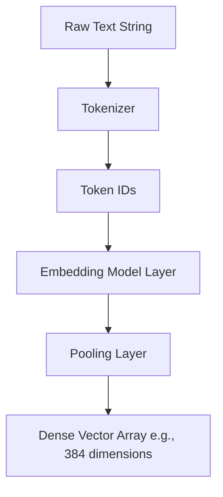

# Concept: Text Embeddings and Embedding Vectors

## Beginner-friendly explanation

Imagine trying to describe the location of a building using latitude and longitude coordinates. Those two numbers pinpoint an exact spot on a map. Text embeddings work similarly, but instead of mapping a physical location in two dimensions, they map the *meaning* of a sentence in hundreds of dimensions. 

When a machine learning model reads a sentence, it outputs a long list of numbers. Sentences with similar meanings will have numbers that end up closer together in this multi-dimensional space.

## Why this concept exists

Traditional search systems rely on keyword matching. If a user searches for "automobile" but the database only contains the word "car", the system fails to find a match. Text embeddings solve this by encoding the underlying meaning. Since "automobile" and "car" share similar contexts, their numerical representations will look almost identical, allowing the computer to recognize them as synonyms without explicit programming.

## Real-world analogy

Think of sorting books in a library. Instead of just sorting alphabetically by title, you decide to assign a score to every book based on genre, tone, target audience age, and historical era. You end up with a scorecard (a vector) for each book. If you want to find a book similar to *The Lord of the Rings*, you look for other books with similar scorecards rather than searching for books with "Ring" in the title.

## AI Translation Platform example

When a company manages a massive translation memory, they need to know if a requested translation is similar to something they translated last year. 

A user might submit: *"The device failed to connect to the network."*
The database might hold: *"Network connection error with the device."*

By converting both sentences into embeddings, the translation platform can instantly identify that these two strings mean the same thing, retrieving the historical translation to maintain consistency and reduce computational cost.

## Internal workflow

1.  **Input:** The system receives a raw text string.
2.  **Tokenization:** The text is split into smaller chunks (tokens) that the model recognizes.
3.  **Forward Pass:** The tokens are fed through a pre-trained neural network (such as a Transformer).
4.  **Pooling:** The network's internal representations are averaged or pooled into a single vector that represents the entire sentence.
5.  **Output:** The system returns a dense array of floating-point numbers.

## Mermaid diagram

## Advantages

*   **Semantic Understanding:** Captures context, nuance, and synonymy better than keyword search.
*   **Fixed Output Size:** Regardless of the input sentence length, the output vector is always the same size, making database storage and comparison highly predictable.
*   **Language Agnostic:** Multilingual embedding models can map similar meanings from different languages into the same vector space.

## Limitations

*   **Computational Cost:** Generating embeddings requires significant CPU or GPU processing power compared to simple hashing.
*   **Information Loss:** Compressing a complex paragraph into a fixed-length vector can result in the loss of nuanced detail.
*   **Lack of Exact Precision:** Embeddings sometimes struggle with subtle negations (e.g., "I love this" vs. "I do not love this" might end up surprisingly close in vector space).

## Why this concept matters

Embeddings are the bedrock of modern Retrieval-Augmented Generation (RAG) and semantic search. Without a reliable way to turn text into math, the downstream tasks of similarity ranking and context retrieval would be impossible.

## Key Takeaways

1.  Text embeddings translate human language into arrays of numbers.
2.  The resulting vectors have a fixed dimensionality determined by the model architecture.
3.  These vectors enable computational systems to evaluate the semantic similarity between two distinct pieces of text.
