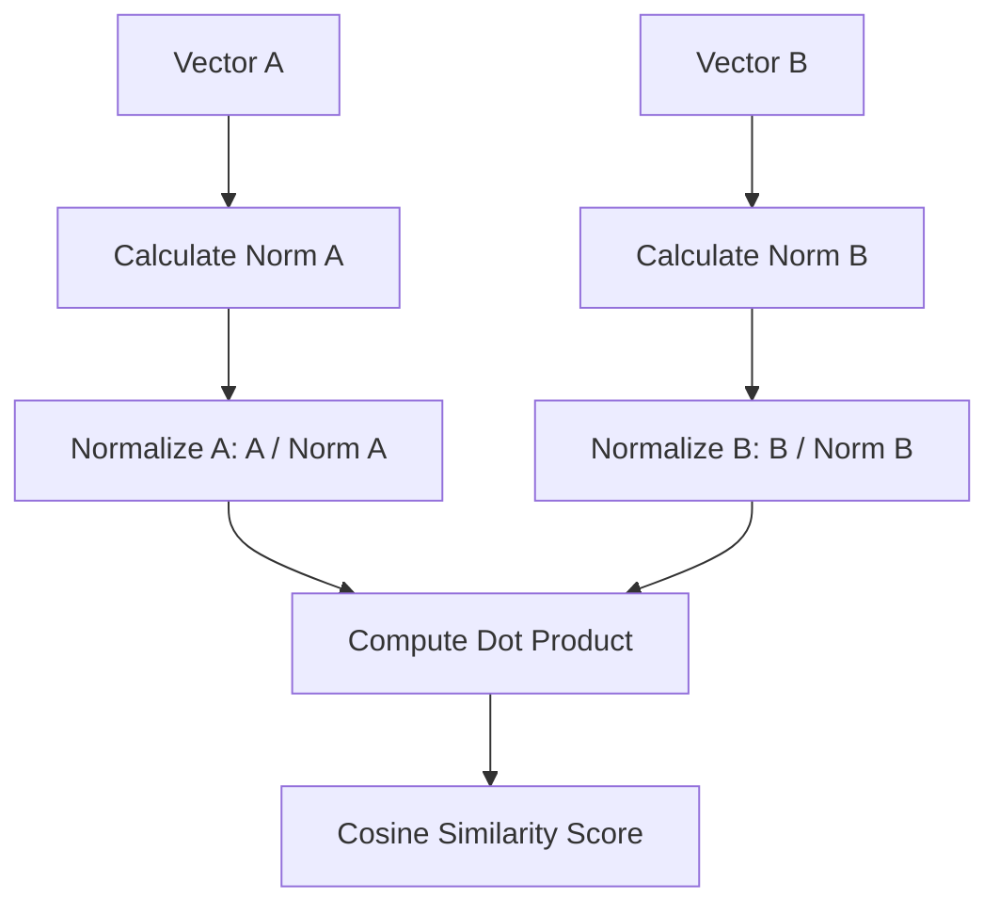

# Concept: Vector Normalization and Cosine Similarity

## Beginner-friendly explanation

Imagine you are standing in an open field, and you point your left arm toward a mountain and your right arm toward a lake. The angle between your arms tells you how far apart those two landmarks are from your perspective. 

Cosine similarity works exactly like this. It measures the angle between two multi-dimensional lines (vectors). If the vectors point in roughly the same direction, the sentences mean roughly the same thing. 

Normalization is the process of making sure your arms are exactly the same length before you measure the angle, ensuring that you are only comparing direction and not distance.

## Why this concept exists

If we just subtracted one vector from another (Euclidean distance), a long document and a short sentence with the exact same meaning might appear mathematically distant simply because of their length. By normalizing the vectors and using cosine similarity, we isolate the *meaning* (the direction) from the *length* (the magnitude).

## Real-world analogy

Think of a clock face. The minute hand points at 12, and the hour hand points at 2. They are separated by a specific angle. It doesn't matter if you are looking at a small wristwatch or the massive Big Ben clock tower; the angle between 12 and 2 is identical. Normalizing vectors is like scaling all clocks down to the size of a wristwatch so they can be easily compared.

## AI Translation Platform example

An engineer wants to find historical translations for the phrase *"System reboot required."*
The database contains *"A reboot of the system is required."*

When embedded, these two sentences form vectors pointing in a very similar direction in a 384-dimensional space. The translation platform computes the cosine similarity between the query and millions of stored strings. A similarity score of `1.0` means they point in the exact same direction (identical meaning). A score of `0.0` means they are entirely unrelated.

## Internal workflow

1.  **Extraction:** Retrieve Vector A (Query) and Vector B (Database Entry).
2.  **Magnitude Calculation:** Calculate the L2 norm (length) of both vectors.
3.  **Normalization:** Divide each vector by its respective norm so their length equals 1.
4.  **Dot Product:** Multiply the normalized vectors together and sum the results.
5.  **Output:** The resulting scalar value represents the Cosine Similarity.

## Mermaid diagram

## Advantages

*   **Scale Invariance:** Completely ignores the magnitude of the vectors, focusing purely on orientation (semantics).
*   **Computational Efficiency:** Once vectors are normalized, cosine similarity is just a dot product, which modern CPUs and GPUs can calculate incredibly fast.
*   **Bounded Output:** Always returns a value between -1 and 1, making it easy to establish confidence thresholds (e.g., "only return matches > 0.85").

## Limitations

*   **Ignores Term Frequency:** Because magnitude is discarded, the system might ignore the emphasis placed on repeated words in a document.
*   **Blind to Syntax:** Two sentences with identical words in a different order might yield high cosine similarity even if their meaning shifts slightly (e.g., "Dog bites man" vs "Man bites dog"), depending heavily on the embedding model's architecture.

## Why this concept matters

This specific mathematical operation is the engine that drives semantic search. If a software engineer doesn't understand that cosine similarity is just the dot product of normalized vectors, they will struggle to optimize database queries or utilize hardware acceleration effectively.

## Key Takeaways

1.  Cosine similarity measures the angle between vectors, determining semantic closeness.
2.  Normalization standardizes vector length to 1.
3.  The dot product of two normalized vectors is mathematically identical to their cosine similarity.
