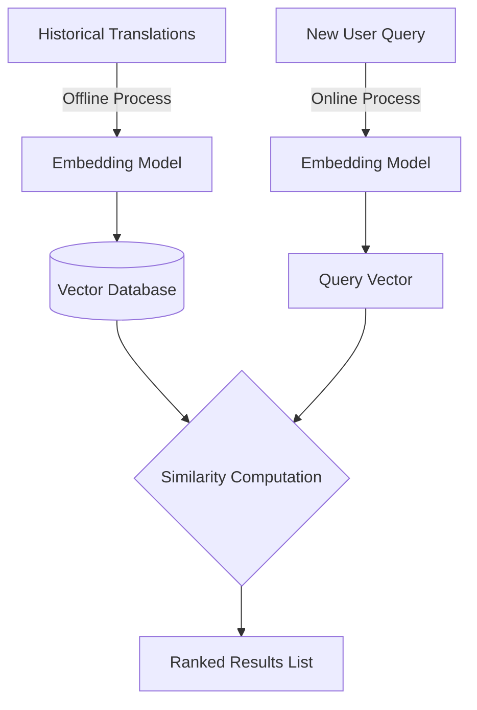

# Concept: Semantic Search and Similarity Ranking

## Beginner-friendly explanation

If you ask a librarian for books about "spaceships", they won't just look for books with the word "spaceship" on the cover. They will also hand you books about rockets, interstellar travel, and astronomy, because they understand the *concept* you are interested in.

Semantic search acts like that librarian. It translates every document in a database into a vector, translates your search query into a vector, and then calculates the distance between them. The database entries that are mathematically closest to your query are returned as the most relevant answers, regardless of whether they share the exact same words.

## Why this concept exists

Keyword search (like SQL `LIKE` or Elasticsearch term matching) is brittle. It suffers from the vocabulary mismatch problem. People use synonyms, make typos, or phrase their problems differently. Semantic search provides a robust, probabilistic way to find information based entirely on intent and meaning, drastically improving recall.

## Real-world analogy

Imagine throwing a dart at a massive wall covered in sticky notes. The dart represents your query. Semantic search is the process of taking a tape measure, measuring the distance from your dart to every single sticky note on the wall, and then handing you the three notes that are physically closest to the dart's landing spot.

## AI Translation Platform example

In an enterprise translation platform, maintaining consistency is critical. If a translator translated *"The payment was rejected"* as *"Le paiement a été refusé"* yesterday, we want to reuse that translation today if someone inputs *"My credit card got declined."*

1.  The platform embeds *"My credit card got declined."*
2.  It runs a semantic search against the Translation Memory.
3.  The system identifies *"The payment was rejected"* as a 92% match.
4.  The system proposes the historical translation to the user, saving time and money while ensuring tonal consistency.

## Internal workflow

1.  **Database Embedding:** (Offline) Embed all canonical documents and store them in a Vector Database (e.g., Pinecone, Milvus, pgvector).
2.  **Query Embedding:** (Online) Receive the user's query and embed it using the exact same model.
3.  **Similarity Matrix:** Calculate the cosine similarity between the query vector and all database vectors.
4.  **Sorting:** Sort the resulting scores in descending order.
5.  **Retrieval:** Return the text payloads associated with the highest-scoring vectors.

## Mermaid diagram

## Advantages

*   **Synonym Recognition:** Flawlessly handles vocabulary mismatches.
*   **Context Awareness:** Can differentiate between different usages of the same word (e.g., "bank" as a financial institution vs. "bank" as a river edge).
*   **Fuzzy Matching:** Inherently resilient to minor typos and phrasing variations.

## Limitations

*   **Search Latency:** Computing cosine similarity against millions of vectors sequentially is slow (O(N) complexity). In production, this requires Approximate Nearest Neighbor (ANN) indexes like HNSW to remain performant.
*   **Black Box:** It can be difficult to explain to a user *why* a specific document was returned, as the matching logic is buried in a high-dimensional mathematical space.

## Why this concept matters

Semantic search is the foundational mechanism that allows generative AI systems to interface with proprietary data. Without it, you cannot reliably feed relevant context to a Large Language Model.

## Key Takeaways

1.  Semantic search compares vectors, not keywords.
2.  Similarity ranking sorts database entries by how close their vectors are to the query vector.
3.  It bridges the gap between user intent and rigid system terminology.
