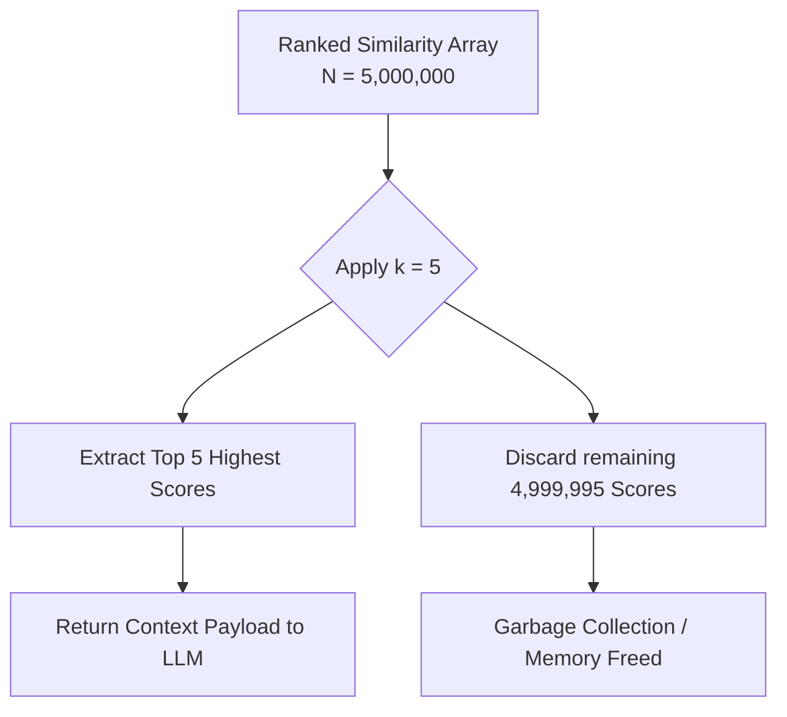

# Concept: Top-k Retrieval

## Beginner-friendly explanation

If you google "how to bake a cake", Google's backend might find 10 million web pages that technically answer your question. However, it doesn't try to show you 10 million pages at once. It shows you the top 10 on the first page.

Top-k retrieval is the mathematical equivalent of that first page of Google. It takes a massive list of ranked items, draws a line under the `k`th item (for example, the 5th item), and throws the rest away. 

## Why this concept exists

When dealing with AI, more information is not always better. If you ask an AI model to translate a sentence and provide it with 100 historical examples, the AI might get confused or distracted by the sheer volume of text (a phenomenon known as "lost in the middle"). Furthermore, processing those 100 examples costs computational time and API credits. We use Top-k to strike a balance: giving the model just enough context to be accurate without overwhelming it.

## Real-world analogy

Imagine panning for gold in a river. You scoop up a huge pan of dirt and rocks (the database). You wash away the mud and sand (the low-similarity results). Eventually, you are left with just the 3 or 4 shiny gold flakes at the bottom of the pan (the Top-k results).

## AI Translation Platform example

A user inputs: *"The battery is overheating."*
The translation platform searches a database of 5 million previously translated strings.

Instead of trying to pass all 5 million strings to the translation AI, the system executes a Top-3 retrieval. It returns:
1. *"Battery overheating detected."* (Score: 0.95)
2. *"Device temperature is too high."* (Score: 0.88)
3. *"Warning: Battery is getting hot."* (Score: 0.82)

These three specific examples are then injected into the prompt, ensuring the AI generates a translation consistent with the company's established terminology.

## Internal workflow

1.  **Similarity Calculation:** Calculate the cosine similarity between the query and all database entries.
2.  **Sorting:** Sort the entire array of scores in descending order.
3.  **Truncation:** Slice the array, keeping only the elements from index `0` to index `k-1`.
4.  **Garbage Collection:** Discard the remaining low-scoring data to free up memory.
5.  **Output:** Return the highly concentrated subset of data.

## Mermaid diagram

## Advantages

*   **Cost Control:** Directly controls the number of tokens sent to an LLM API, keeping costs predictable.
*   **Latency Reduction:** Smaller payloads move faster across the network.
*   **Improved Accuracy:** Prevents the LLM from hallucinating based on low-relevance "tail" data.

## Limitations

*   **Hard Cutoffs:** If `k=3` but the 4th item is genuinely crucial to understanding the context, the system completely misses it.
*   **Dynamic Relevance Issue:** Sometimes a query requires 10 examples to establish context, while other times 1 example is sufficient. A fixed `k` cannot adapt to the complexity of the query.

## Why this concept matters

Understanding `k` is essential for prompt engineering. If an engineer sets `k` too high, they bloat the prompt and waste API credits. If they set `k` too low, they starve the model of necessary context.

## Key Takeaways

1.  Top-k retrieval truncates a ranked list to a fixed size.
2.  It acts as a filter to protect downstream systems (like LLMs) from information overload.
3.  The value of `k` represents an engineering trade-off between context richness and operational cost.
