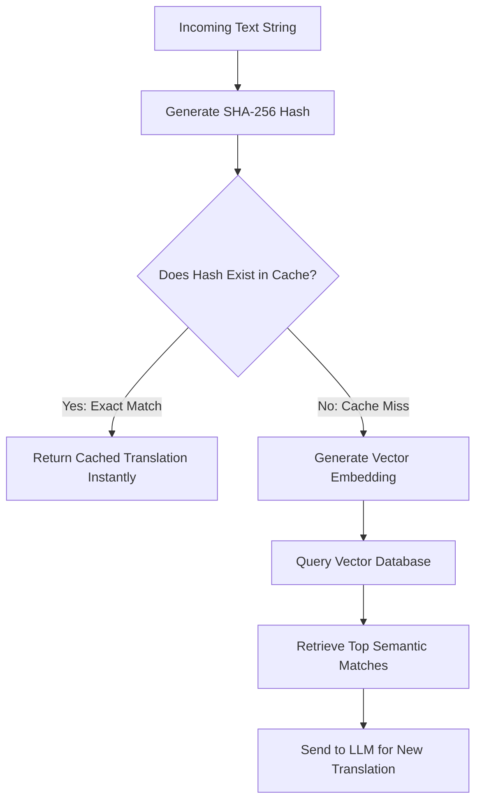

# Concept: Exact Matching vs Semantic Matching

## Beginner-friendly explanation

If you walk into a coffee shop and order exactly what you ordered yesterday, "One large black coffee," the barista remembers you and hands it over instantly. That is **Exact Matching**. 

But if you walk in and say, "I need something dark, caffeinated, and hot in a big cup," the barista has to think for a second, interpret your meaning, and then realize you want a large black coffee. That is **Semantic Matching**. The first is faster, but the second is more flexible.

## Why this concept exists

We build AI systems to handle nuance, but nuance is expensive. In computer science, checking if two things are identical using a hash (a unique digital fingerprint) is one of the fastest operations possible. We combine both approaches to build a system that is blindingly fast when dealing with familiar data, but highly adaptable when dealing with new or messy data.

## Real-world analogy

Think of fingerprint scanners versus facial recognition. A fingerprint scanner (Exact Match) demands a perfect, 100% identical read of the grooves on your finger. If it matches, the door opens instantly. Facial recognition (Semantic Match) is probabilistic. You might be wearing glasses, smiling, or standing in bad lighting. The system calculates a similarity score to guess if it's you. It is slower and requires more processing, but it handles variations gracefully.

## AI Translation Platform example

When an enterprise client translates their documentation, many sentences never change across versions (e.g., *"All rights reserved."*). 
1. The platform hashes *"All rights reserved."* and finds an instant match in the cache. The translation is applied in 0.001 seconds.
2. The next sentence is *"All rights are reserved by the publisher."*
3. The exact match fails. The system falls back to semantic search, embeds the sentence, finds the previous version, and passes it to the LLM to generate the slightly updated translation.

## Internal workflow

1.  **Incoming Request:** The system receives the string.
2.  **Hashing:** The system generates a SHA-256 hash of the string.
3.  **Cache Lookup:** It checks a key-value store (like Redis) for that hash.
4.  **Success Path:** If found, return the exact translation. End of process.
5.  **Failure Path:** If not found, send the string to the embedding model.
6.  **Vector Search:** Compare the new vector against the vector database to find the closest semantic match.

## Mermaid diagram

## Advantages of Exact Matching
*   **Zero Compute Cost:** No neural networks or GPUs are required.
*   **Absolute Determinism:** You know exactly what the output will be, with zero risk of AI hallucination.
*   **Instant Latency:** Perfect for high-traffic endpoints.

## Advantages of Semantic Matching
*   **High Recall:** Finds relevant data even when the exact phrasing is entirely different.
*   **Resilience:** Ignores typos, punctuation differences, and synonym substitutions.

## Why this concept matters

Junior engineers often try to solve every problem with AI. Senior engineers know that AI should only be used when traditional deterministic algorithms fail. Combining hash lookups with vector search creates a system that is both economically viable and intellectually robust.

## Key Takeaways

1.  Always try to find an exact match first using cheap $O(1)$ hash lookups.
2.  A single altered character completely changes a hash, breaking the exact match.
3.  Semantic search serves as a robust fallback mechanism for when deterministic logic fails.
