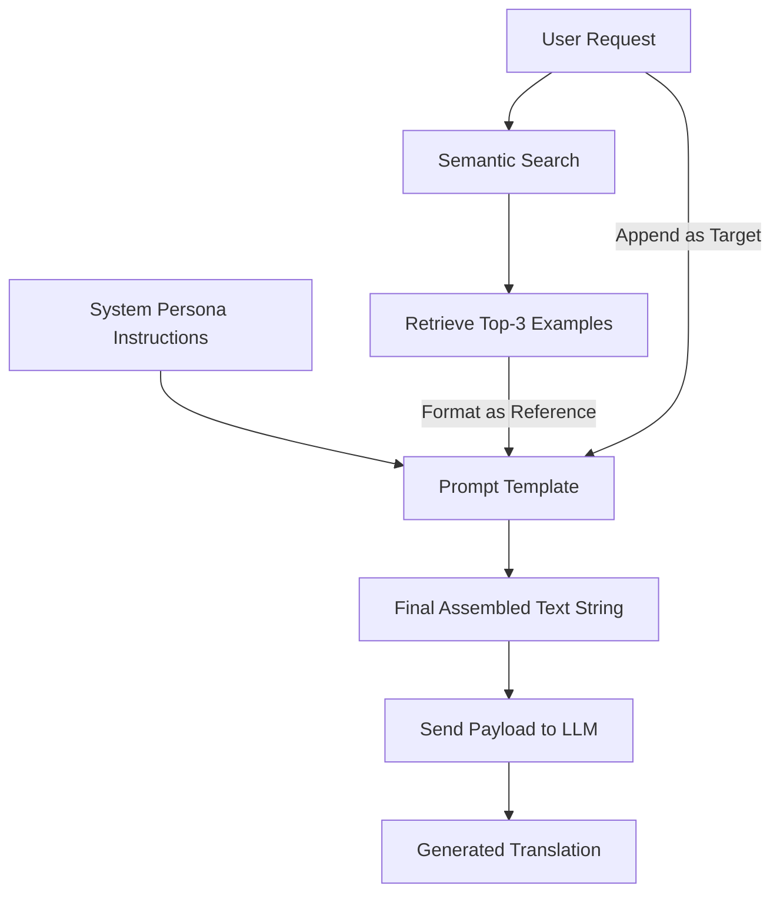

# Concept: Using Retrieved Examples as Context

## Beginner-friendly explanation

Imagine you are hiring a freelance translator. If you just hand them a sentence and say, "Translate this to French," they will do their best, but they might use different words than your previous translator used. 

However, if you hand them the sentence along with a specific instruction: "Translate this to French. For reference, here are three similar sentences we translated last year," the freelancer will naturally adapt their writing style to match the examples. 

Injecting context into a prompt is exactly like handing those reference files to a freelancer.

## Why this concept exists

Models like GPT-4 are trained on the entire internet. They know ten different ways to translate the word "Network." An enterprise company usually only approves one specific translation for "Network." By utilizing retrieved context, we mathematically constrain the LLM's probability distribution, forcing it to choose the vocabulary that matches our specific history. 

## Real-world analogy

Think of a lawyer writing a legal brief. They don't just invent arguments from scratch; they cite previous case law to justify their current position. The RAG pipeline acts as the paralegal finding the relevant case law, and the Prompt Construction step is the lawyer assembling those cases into a structured, persuasive document.

## AI Translation Platform example

User requests translation for: *"The battery is running low. Please connect to the charger."*

The system retrieves historical translations regarding batteries and chargers. It formats them into a block:
*   *English:* Battery level is low. -> *French:* Le niveau de la batterie est faible.
*   *English:* Please connect the charger. -> *French:* Veuillez brancher le chargeur.

The LLM reads these examples. It realizes that the company prefers the term "faible" for "low" and "brancher" for "connect." It then generates a brand new, highly accurate translation using that specific vocabulary, rather than just copying an example or guessing wildly.

## Internal workflow

1.  **Retrieval:** Execute the Top-k semantic search to get relevant records.
2.  **System Prompting:** Define the overarching persona and rules for the LLM.
3.  **Context Assembly:** Loop through the retrieved records, formatting them into clearly marked reference blocks (e.g., using Markdown or XML tags).
4.  **Query Injection:** Append the actual user request at the very bottom.
5.  **API Call:** Send the combined string to the LLM endpoint for generation.

## Mermaid diagram

## Advantages

*   **Consistency:** Guarantees terminology alignment across massive organizations.
*   **Zero-Training Required:** You do not need to fine-tune the LLM (which is expensive and difficult). You simply educate it dynamically at runtime.
*   **Traceability:** If the LLM generates a weird translation, engineers can look at the injected context to see if bad historical data caused the error.

## Limitations

*   **Token Limits:** Context consumes tokens. If you inject too much context, you hit API limits or increase latency and costs.
*   **Context Poisoning:** If the semantic search retrieves a terrible, incorrect historical translation, the LLM will likely copy that error. The generation is only as good as the retrieval.

## Why this concept matters

This is where the entire pipeline comes together. If the prompt is formatted poorly, the LLM might confuse the historical context for the text it is supposed to translate. Strict, clean prompt engineering ensures the model understands exactly what is reference material and what is the target task.

## Key Takeaways

1.  Retrieved examples are context only; they guide the model but are never copied directly unless the match is exact.
2.  Proper prompt formatting (using clear headers and delimiters) prevents the LLM from getting confused.
3.  In-context learning allows general-purpose models to act like highly specialized enterprise tools.
